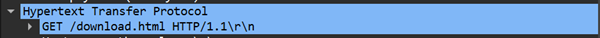
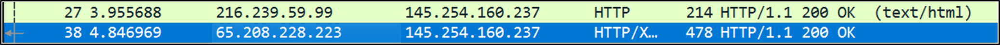
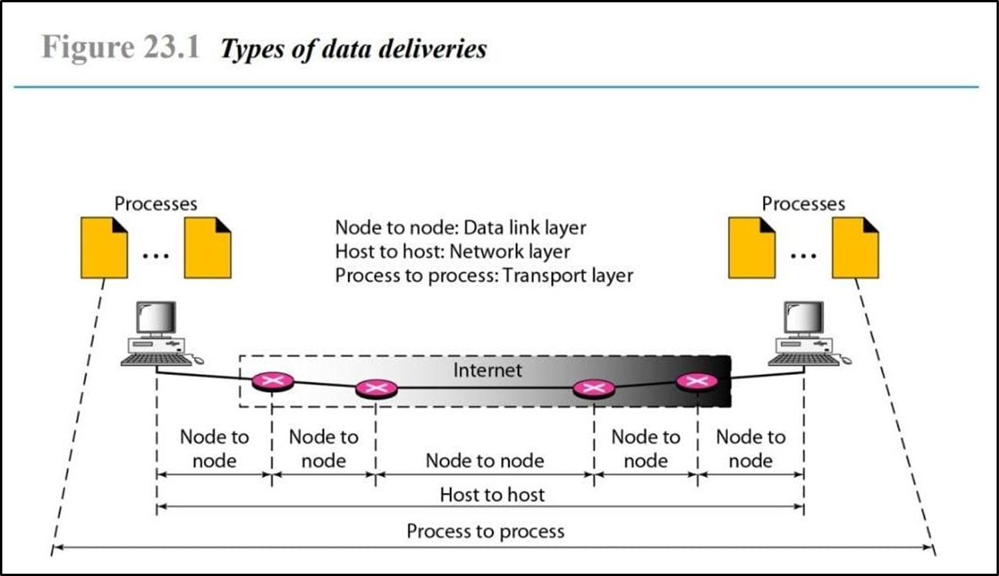

  <h1 class="text-align: center;font-weight: bold"><h1>Workshop Administrasi Jaringan</h1>
  <h3 class="text-align: center;">Dosen Pengampu : Dr. Ferry Astika Saputra, S.T., M.Sc.</h3>

 

  
  

  <h3 style="text-align: center;">Disusun Oleh :</h3>
 

    <em>Muhammad Rasyid Rafif (3122500030)</em>
  

<h3 style="text-align: center;line-height: 1.5">Politeknik Elektronika Negeri Surabaya Departemen Teknik Informatika Dan Komputer Program Studi Teknik Informatika 2023/2024</h3>
  

Tugas I
1.	Analisa file http.cap menggunakan Wireshark 
Jawab:

Versi HTTP yang digunakan adalah versi 1.1

IP address yang digunakan client adalah 145.254.160.237
IP address yang digunakan server adalah 65.208.228.223

Waktu dari client mengirimkan HTTP request adalah 0.911310

Waktu dari server mengirimkan server adalah 3.955688

Durasi untuk menyelesaikan sesi HTTP request adalah 4,846969 - 3.955688 = 0,891281

2.  Deskripsikan Gambar Pada Slide

Penjelasan: Gambar tersebut menunjukkan tentang proses Node-to-Node dalam Data Link Layer, Host-to-Host dalam Network Layer, dan Process-to-Process dalam Transport Layer
Node-to-Node mengggunakan Data Link Layer yang membungkus data dalam bentuk frame yang berisi dengan alamat fisik (MAC address), error detection, dan flow control.

Host-to-Host menggunakan Network Layer yang membungkus data dalam bentuk packet yang berisi dengan alamat IP (IP address) dengan fungsi untuk mencari jalur terbaik untuk mencapai tujuannya.

Process-to-Process menggunakan transport layer yang membungkus data dalam bentuk segment yang berisi dengan port number agar membedakan antar proses atau aplikasi. Dalam segment juga terdapat protocol TCP dan UDP untuk sistem pengiriman dan penerimaan data. 

3.	Tahapan komunikasi menggunakan TCP

&nbsp;Tahapan komunikasi utama dalam penggunaaan TCP terdapat Establish Connection menggunakan Three-Way Handshake, Data Transmission, dan Connection Termination.

•	Tahap Komunikasi Pertama

&nbsp;Melakukan Establish Connection dengan Three-Way Handshake yaitu dengan client mengirim segmen SYN ke server untuk memulai koneksi, lalu server merespons dengan SYN-ACK, setelah itu, client membalas dengan ACK terakhir. Setelah proses ini selesai, koneksi TCP antar client dan server telah terbentuk.
 
•	Tahap Komunikasi Kedua 

&nbsp;Dilakukannya Data Transmission atau proses pengiriman data. Saat data dikirim, data tersebut akan di pecah menjadi segmen-segmen yang berukuran sama atau kurang. Setiap segmen yang terpecah memiliki sequence number masing masing yang dimana saat diterima oleh server akan mengirimkan ACK kepada client. Jika server tidak menerima pecahan segmen, maka TCP akan mengirimkan ulang segmen yang belum diterima.

•	Tahap Komunikasi Ketiga 

&nbsp;Connection Termination adalah proses terminasi koneksi antar client dan server. Proses ini dimulai saat salah satu pihak (client atau server) mengirim segmen FIN untuk mengakhiri transmisi. Pihak lain merespons dengan ACK dan juga mengirim FIN untuk memutuskan koneksi. Setelah itu pengirim akan menutup koneksi setelah menerima ACK terakhir.

