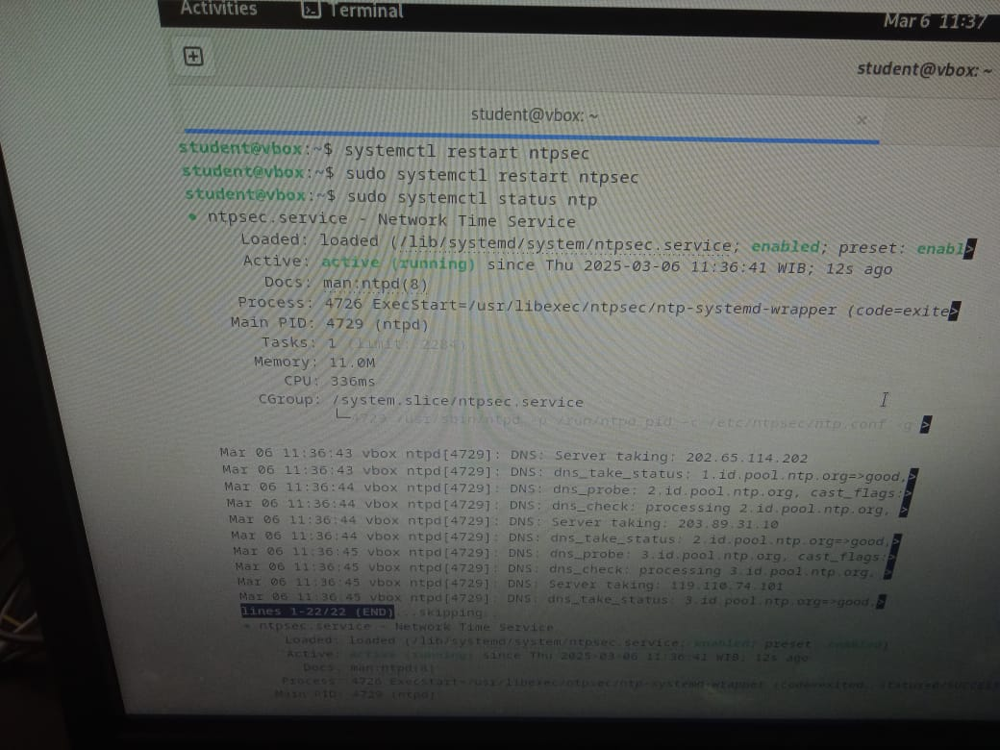
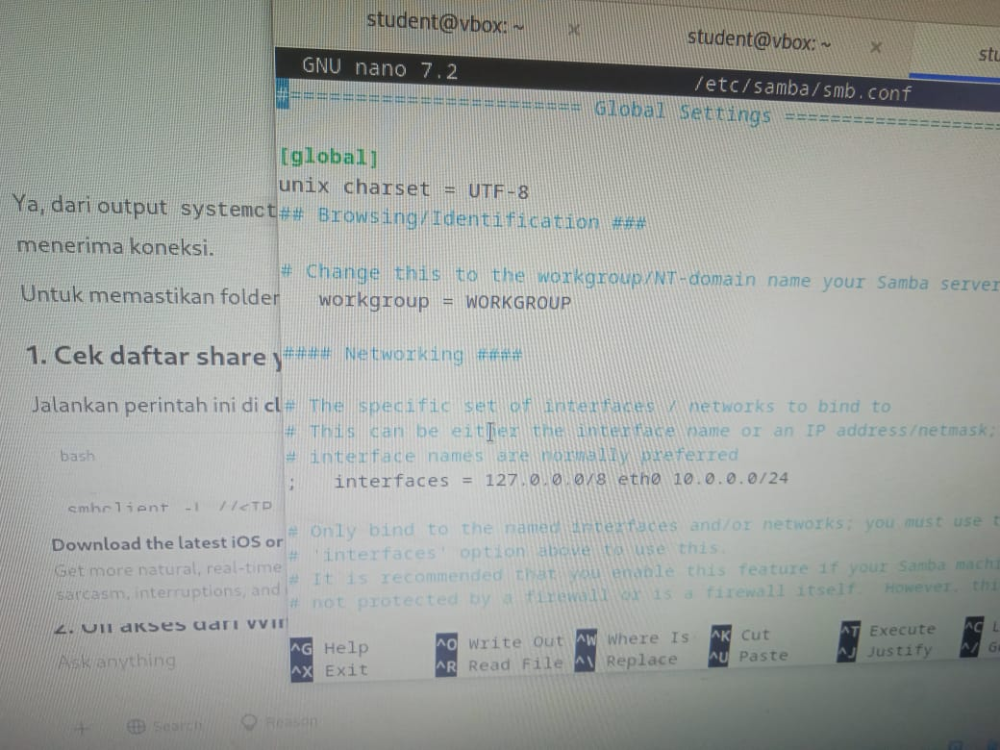
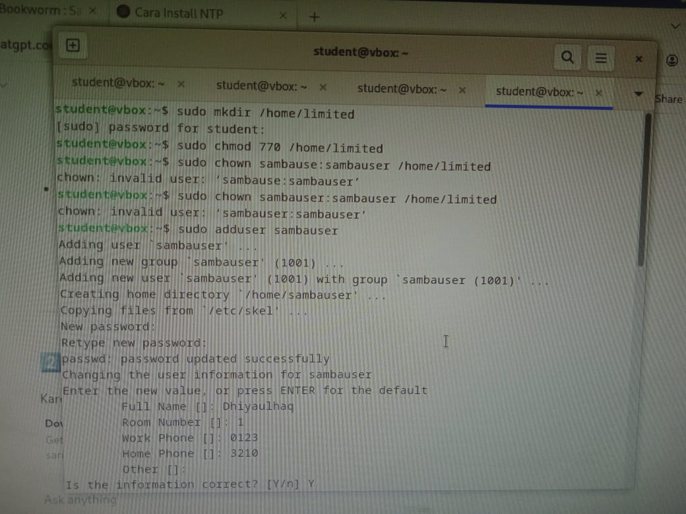
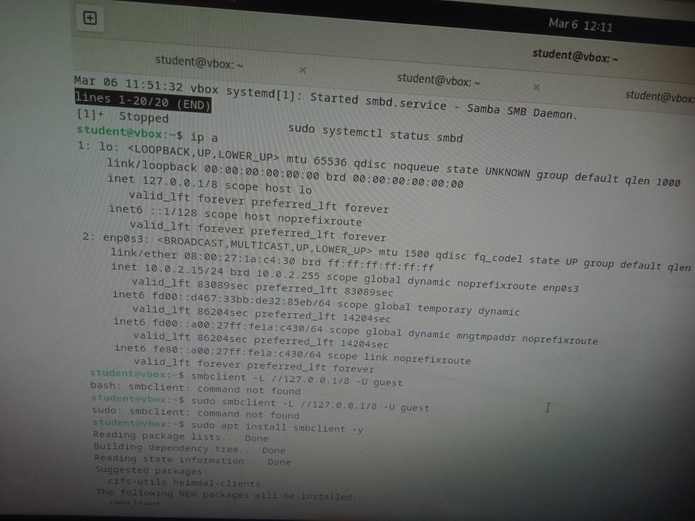
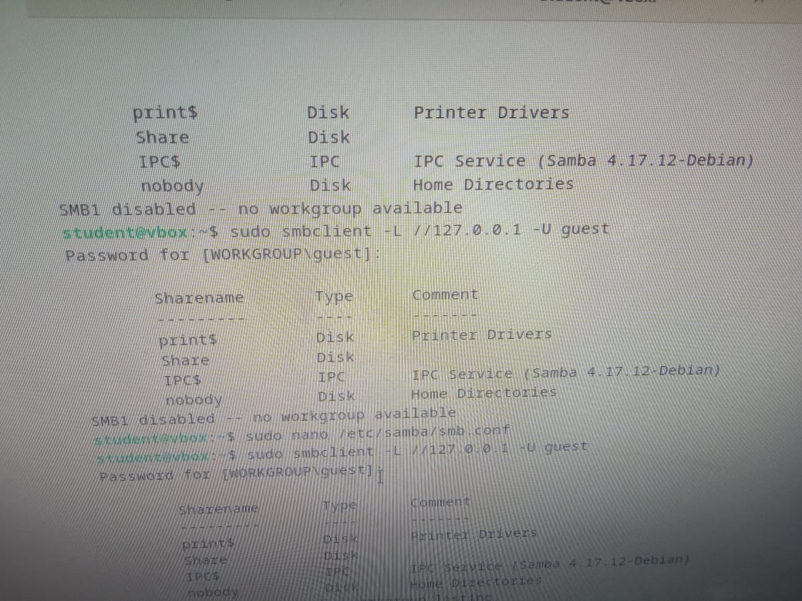

<div align="center">
  <h1 class="text-align: center;font-weight: bold"><h1>Workshop Administrasi Jaringan</h1>
  <h3 class="text-align: center;">Dosen Pengampu : Dr. Ferry Astika Saputra, S.T., M.Sc.</h3>
</div>
<br />
<div align="center">
  
  <div align="center">
  <h3 style="text-align: center;">Disusun Oleh :</h3>
 <p style="text-align: center;">
    <em>Muhammad Rasyid Rafif (3122500030)</em>
  </p>
</div>


# 1: Instalasi NTP

#" NTP (**Network Time Protocol**) adalah protokol yang digunakan untuk menyinkronkan waktu antara komputer dalam suatu jaringan. NTP bekerja dengan menghubungkan perangkat ke server yang kredibel, biasanya berbasis UTC (Coordinated Universal Time), untuk memastikan keseragaman waktu di seluruh sistem.
  


## Instalasi
Untuk menginstal NTP di sistem Anda, jalankan perintah berikut:
```sh
sudo apt install ntp -y
```


## Konfigurasi
Edit file konfigurasi NTP untuk menggunakan server NTP Indonesia:
```sh
sudo nano /etc/ntp.conf
```


Ganti server default dengan server NTP Indonesia berikut:
```sh
server id.pool.ntp.org iburst
```


Sebenarnya tiga saja sudah cukup, karena sudaah  dapat digunakan untuk menynkronkan waktu secara andal kalau salah satunya mati. NTP juga nantinya akan memilih server dengan latensi terbaik. Justru terlalu banyak server akan menambah beban berlebih tanpa profit yang signifikan.
Simpan dan keluar dari file (tekan `CTRL + X`, lalu `Y`, dan tekan `Enter`).

## Restart Layanan NTP
Setelah melakukan perubahan, restart layanan NTP dengan perintah berikut:
```sh
sudo systemctl restart ntp
```



## Verifikasi Status NTP
Periksa apakah NTP berfungsi dengan baik menggunakan perintah berikut:
```sh
ntpq -p
```


NTP sudah berhasil diubah ke server Indonesia.

#Bagian 2: Instalasi Samba

## Definisi
Samba atau yang awalnya disebut SMB(Server Message Block adalah perangkat lunak open-source yang memungkinkan komunikasi dan berbagi file melalui protokol SMB/CIFS. Samba mendapatkan atensii besar karena ia bisa menghubungkan Linux/Unix dengan Windows sehingga banyak digunakan.

## Panduan Instalasi dan Konfigurasi Samba

## 1. Instalasi Samba
Untuk menginstal Samba, jalankan perintah berikut:
```sh
sudo apt -y install samba 
```


## 2. Membuat Direktori untuk Share
Sebelum mengedit konfigurasi, buat direktori yang akan digunakan untuk berbagi file:
```sh
mkdir /home/share
chmod 777 /home/share
```


## 3. Edit Konfigurasi Samba (`smb.conf`)
Buka file konfigurasi Samba untuk diedit:
```sh
sudo vi /etc/samba/smb.conf
```


## 4. Ubah Pengaturan Jaringan
Tambahkan atau ubah baris berikut dalam file `smb.conf`:
```sh
interfaces = eth0 10.0.0.0/24
bind interfaces only = yes
```


## 5. Konfigurasi Guest Access
Ubah opsi berikut untuk mengatur akses guest:
```sh
map to guest = bad user
```


## 6. Konfigurasi Share Folder
Tambahkan konfigurasi share di bagian paling bawah file `smb.conf`:
```sh
[Share]
   path = /home/share
   writable = yes
   read only = no
   guest ok = yes
   guest only = yes
   force create mode = 777
   force directory mode = 777

```


## 7. Restart Layanan Samba
Setelah melakukan perubahan, restart layanan Samba:
```sh
sudo systemctl restart smbd
```


## 8. Menambahkan Pengguna Samba
Proses ini diperlukan kalau ingin membuat dan mengakses folder limited
```sh
sudo adduser sambauser
```


Atur kepemilikan folder agar sesuai:
```sh
sudo chown sambauser:sambauser /home/limited
```

Verifikasi pengguna Samba:
```sh
cat /etc/passwd | grep sambauser
```


## 9. Buat direktori limited
Buat direktori limited pada CLI
```sh
sudo mkdir /home/limited
sudo chown 770 /home/limited
```

`
Tambahkan konfigurasi untuk folder **limited**:
```sh
[limited]
   path = /home/limited
   browseable = yes
   read only = no
   valid users = sambauser
   force user = sambauser
```


Akses dengan `smbclient` harusnya sudah terdaftar


      
## 10. Cek Koneksi dan Akses Samba
  Cek IP untuk koneksi:
```sh
ip a
```

  Jika `smbclient` belum terinstal:
```sh
sudo apt install smbclient -y
```



  Cek direktori

  


Jika user masih terdeteksi sebagai `nobody`, perbaiki dengan menambahkan konfigurasi berikut di `smb.conf`:
```sh
unix charset = UTF-8
client min protocol = NT1
server min protocol = NT1
```


## 11.  Akses File Sharing
1. Coba akses file sharing di CLI
  ```sh
  sudo smbclient //127.0.0.1/Share -U Guest
  ```


perintah `ls` digunakan untuk mengecek isi file dalam folder Share. Untuk memasukkan file dari komputer, gunakan perintah `put`


2. Ubah jaringan ke **Bridged Adapter** di pengaturan VirtualBox.


3. Cek share Samba dari komputer lain
   ```sh
   smbclient -L //<IP-TEMAN> -U sambauser
   ```
   


  Coba akses dari file manager


4. Coba akses folder **limited**:
   ```sh
   smbclient //localhost/limited -U sambauser
   ```
  

   
5. Pastikan bisa membuka file dari sistem luar VirtualBox.
Untuk mengakses folderlimited, nanti hanya ada user yang diijinkan yang bisa mengakses. User nanti juga harus memasukkan password.   


## Rangkuman

1. Debian 12
Debian adalah sistem operasi Linux yang terkenal karena stabilitas dan keamanannya.
Versi terbaru, Debian 12 (Bookworm), menghadirkan berbagai pembaruan dan peningkatan kinerja dibandingkan versi sebelumnya.
2. Proses Instalasi Debian 12
Buku ini menguraikan langkah-langkah instalasi Debian 12, termasuk pemilihan paket dan pengaturan awal sistem.
Dijelaskan pula penggunaan Debian Installer untuk mengelola partisi, akun pengguna, serta konfigurasi jaringan dasar.
3. Pengelolaan Pengguna dan Hak Akses
Menjelaskan cara membuat, menghapus, serta mengatur akun pengguna dalam Debian 12.
Pembahasan mengenai sistem izin file (permissions), grup pengguna, dan kebijakan keamanan yang perlu diterapkan.
4. Pengelolaan Paket dengan APT
Cara menginstal, memperbarui, dan menghapus perangkat lunak menggunakan perintah seperti apt-get, apt-cache, dan dpkg.
Penjelasan tentang repositori Debian serta cara menambahkan sumber paket baru ke dalam sistem.
5. Konfigurasi Jaringan
Membahas dasar-dasar pengaturan jaringan, termasuk alamat IP, DNS, dan gateway.
Penggunaan perintah ip, ifconfig, serta nmcli untuk mengelola koneksi jaringan.
6. Administrasi Sistem
Memantau performa sistem dengan perintah seperti top, htop, df, dan free.
Mengelola layanan menggunakan systemd (systemctl start/stop/status).
Konfigurasi keamanan jaringan melalui ufw atau iptables.
7. Keamanan Sistem
Panduan untuk meningkatkan keamanan Debian 12, seperti pembaruan sistem, manajemen akses pengguna sudo, serta pengamanan akses SSH.
Penggunaan fail2ban sebagai perlindungan terhadap serangan brute-force.
8. Backup dan Pemulihan Data
Strategi pencadangan menggunakan rsync, tar, dan cron jobs.
Metode pemulihan sistem dalam situasi kehilangan data atau kerusakan sistem.
9. Automasi dengan Skrip Bash
Pengantar scripting menggunakan Bash untuk mengotomatisasi tugas administrasi sistem.
Contoh skrip sederhana untuk monitoring sistem dan pembaruan otomatis.

## Referensi
[NTP Client](https://www.server-world.info/en/note?os=Debian_12&p=ntp&f=1)

[Samba](https://www.server-world.info/en/note?os=Debian_12&p=samba&f=1)
</div>


