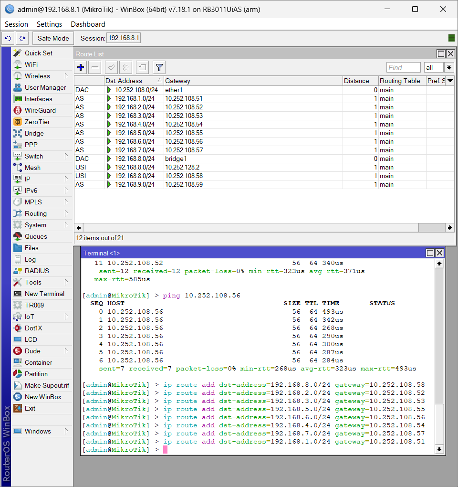
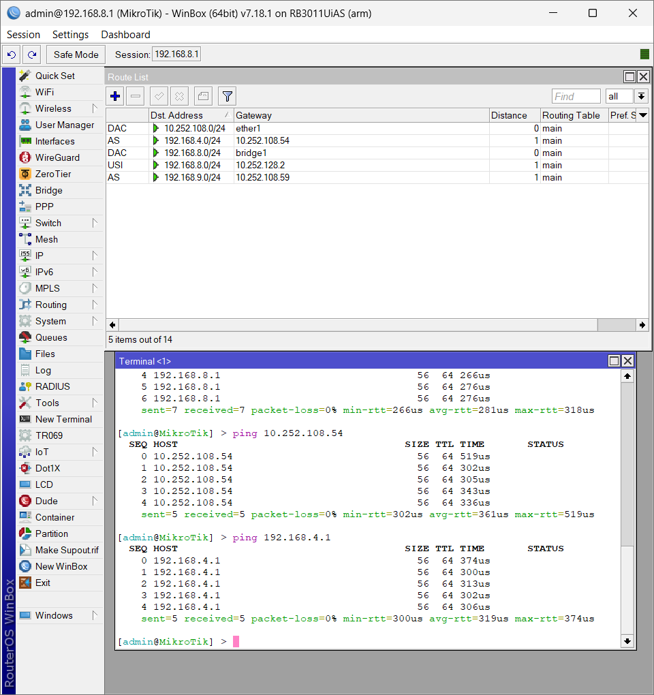

<div align="center">
  <h1 class="text-align: center;font-weight: bold"><h1>Workshop Administrasi Jaringan</h1>
  <h3 class="text-align: center;">Dosen Pengampu : Dr. Ferry Astika Saputra, S.T., M.Sc.</h3>
</div>
<br />
<div align="center">
  
  <div align="center">
  <h3 style="text-align: center;">Disusun Oleh :</h3>
 <p style="text-align: center;">
    <em>Muhammad Rasyid Rafif (3122500030)</em>
  </p>
</div>

<h3 style="text-align: center;line-height: 1.5">Politeknik Elektronika Negeri Surabaya<br>Departemen Teknik Informatika Dan Komputer<br>Program Studi Teknik Informatika<br>2023/2024</h3>
  <hr><hr>
</div>

## Setting mikrotik

### 1. Tambah IP STATIS Kelompok lain ( Kelompok 1-10) beserta gatewaynya masing masing.

Untuk menambahkan alamat IP statis ke perangkat dengan gateway MikroTik, gunakan WinBox untuk membuka terminal baru, lalu jalankan perintah berikut:
`/ip route add dst-address=192.168.x.0/24 gateaway=10.252.108.5x` 
X itu untuk misalnya kelompok 1 itu Xnya diganti 1. Contoh menambahkannya ada gambar dibawah ini : 



Gambar diatas itu ada IP dari kelompok 1-10

### 2. Test Ping IP Kelompok lain
Untuk Test Ping ke kelompok lain anda bisa menggunakan perintah `ping 192.168.X.1` X itu untuk Kelompok. Contohnya ada digambar dibawah ini : 



Test ping menunjukan hasil dibawah ini. Dari gambar diatas menunjukkan pesan TTL maka pc anda dengan pc kelompok lain sudah terhubung.

```bash 

Misalnya :
# TTL = PC bisa mengirim paket pc lain. dan sudah terhubung.

## RTO = indikasi bahwa pengirim belum menerima paket. Ketika waktu RTO habis tanpa menerima konfirmasi, sistem mengasumsikan bahwa:
- Paket mungkin hilang dalam perjalanan
- Konfirmasi penerimaan mungkin hilang dalam perjalanan
- Terjadi kemacetan jaringan yang signifikan

### Unreachable = berarti suatu host atau jaringan tidak dapat dijangkau / PC anda dan kelompok lain belum terhubung.

```

